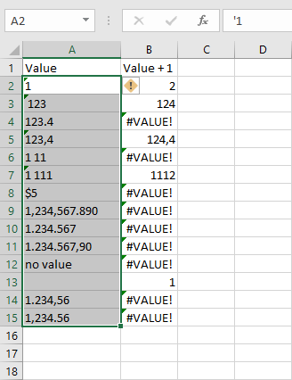
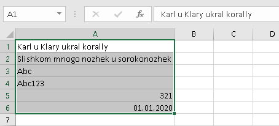
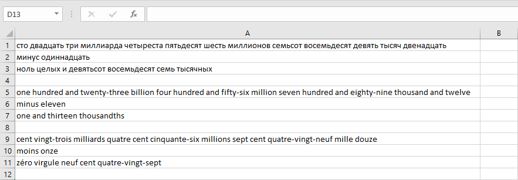
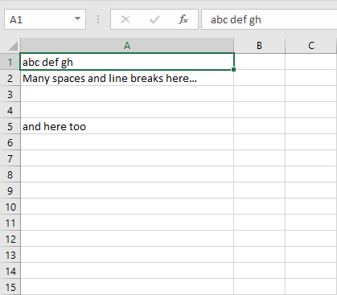
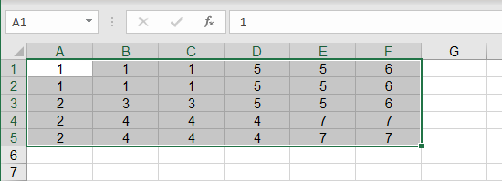

 [Russian](README_RU.md) |  **English**

# Navferty's Excel Add-In

A free Excel add-in that enhances productivity with tools for data manipulation, formatting, and validation.


## Features
 - [Parse Numerics](#parse-numerics)
 - [Replace (Transliteration or Analogues)](#replace)
 - [Stringify Numerics](#stringify-numerics)
 - [Toggle Case](#toggle-case)
 - [Trim Spaces](#trim-spaces)
 - [Unprotect Workbook](#unprotect-workbook)
 - [Worksheets Protection](#worksheets-protection)
 - [Highlight Duplications](#highlight-duplications)
 - [Unmerge Cells](#unmerge-cells)
 - [Find All Cells Containing Errors](#find-all-cells-containing-errors)
 - [Copy as Markdown](#copy-as-markdown)
 - [Validate Values](#validate-values)
 - [Export to SQLite](#export-to-sqlite)
 - [Create Sample XML based on XSD](#create-sample-xml-based-on-xsd)
 - [Validate XML with XSD](#validate-xml-with-xsd)
 - [Undo Last Action](#undo-last-action)

## Installation

Download and run [the installation file](https://deploy.navferty.ru/setup.exe) to install the add-in for Excel.

After installation, restart Excel if it was open. You should see the new **Navferty's Tools** tab in the ribbon.

**Note:** If you encounter a security warning about the certificate, see [detailed installation instructions](#how-to-install-the-add-in) below.

---

## Parse Numerics

Convert numbers stored as text to proper numeric format, making them usable in calculations.

<details>
  <summary>View screenshots</summary>



</details>

## Replace

Replace Russian characters using different transformation methods.

### With Transliteration

Complete transliteration of Russian alphabet to English. For example: "Ж" → "Zh", "Щ" → "Shch". Based on ICAO Doc [9303](https://www.icao.int/publications/Documents/9303_p3_cons_en.pdf).

<details>
  <summary>View screenshots</summary>



</details>

### Replace Chars

Replace only visually similar letters: А↔A, В↔B, Е↔E, К↔K, М↔M, Н↔H, О↔O, Р↔P, С↔C, Т↔T, У↔Y, Х↔X.

<details>
  <summary>View screenshots</summary>


</details>

## Stringify Numerics

Convert numbers to their word representation in multiple languages:
- Russian
- English
- French

<details>
  <summary>View screenshots</summary>



</details>

[Up](#navfertys-excel-add-in)

---

## Toggle Case

Cycle through text case transformations: `Abcde` → `abcde` → `ABCDE`

<details>
  <summary>View screenshots</summary>


</details>

## Trim Spaces

Remove extra spaces, line breaks, and leading/trailing whitespace from text cells.

<details>
  <summary>View screenshots</summary>



</details>

[Up](#navfertys-excel-add-in)

---

## Unprotect Workbook

Remove protection from all worksheets, workbook structure, and VBA projects without needing passwords. 

*Note: Does not work with encrypted workbooks.*

## Worksheets Protection

Set or remove protection on multiple worksheets at once.

## Highlight Duplications

Automatically color-code duplicate values in the selected range. Different colors indicate different duplicate groups.

<details>
  <summary>View screenshot</summary>


</details>

## Unmerge Cells

Unmerge cells while filling each cell with the original merged value.

<details>
  <summary>View screenshots</summary>



</details>

## Find All Cells Containing Errors

Locate all formula errors in the selected range: `#N/A`, `#NAME?`, `#DIV/0!`, `#REF!`, `#VALUE!`, `#NUM!`, `#NULL!`

<details>
  <summary>View screenshot</summary>


</details>

## Copy as Markdown

Copy selected cells to clipboard as a markdown-formatted table.

<details>
  <summary>View screenshot</summary>


</details>

## Validate Values

Check cell values against specific formats:
- Number
- Date
- TIN of an individual (12 digits with verification)
- TIN of a legal entity (10 digits with verification)
- Text for XML (no invalid characters)

*Note: Valid TIN format doesn't guarantee the organization or individual exists.*

<details>
  <summary>View screenshot</summary>


</details>

[Up](#navfertys-excel-add-in)

---

## Export to SQLite

Export the entire workbook to a SQLite database file. Each worksheet becomes a separate table with automatic column type detection.

<details>
  <summary>View screenshots</summary>


</details>

[Up](#navfertys-excel-add-in)

---

## Create Sample XML based on XSD

Generate a sample XML file from an XSD schema to visualize the structure.

<details>
  <summary>View example</summary>

**Input XSD Schema:**

```XML
<?xml version="1.0" encoding="UTF-8" ?>
<xs:schema xmlns:xs="http://www.w3.org/2001/XMLSchema">

<xs:element name="shiporder">
  <xs:complexType>
    <xs:sequence>
      <xs:element name="orderperson" type="xs:string"/>
      <xs:element name="shipto">
        <xs:complexType>
          <xs:sequence>
            <xs:element name="name" type="xs:string"/>
            <xs:element name="address" type="xs:string"/>
            <xs:element name="city" type="xs:string"/>
            <xs:element name="country" type="xs:string"/>
          </xs:sequence>
        </xs:complexType>
      </xs:element>
      <xs:element name="item" maxOccurs="unbounded">
        <xs:complexType>
          <xs:sequence>
            <xs:element name="title" type="xs:string"/>
            <xs:element name="note" type="xs:string" minOccurs="0"/>
            <xs:element name="quantity" type="xs:positiveInteger"/>
            <xs:element name="price" type="xs:decimal"/>
          </xs:sequence>
        </xs:complexType>
      </xs:element>
    </xs:sequence>
    <xs:attribute name="orderid" type="xs:string" use="required"/>
  </xs:complexType>
</xs:element>

</xs:schema>
```

**Generated XML Output:**

```XML
<shiporder xmlns:xsi="http://www.w3.org/2001/XMLSchema-instance" orderid="orderid1">
  <orderperson>orderperson1</orderperson>
  <shipto>
    <name>name1</name>
    <address>address1</address>
    <city>city1</city>
    <country>country1</country>
  </shipto>
  <item>
    <title>title1</title>
    <note>note1</note>
    <quantity>1</quantity>
    <price>1</price>
  </item>
  <item>
    <title>title2</title>
    <note>note2</note>
    <quantity>79228162514264337593543950335</quantity>
    <price>-79228162514264337593543950335</price>
  </item>
  <item>
    <title>title3</title>
    <note>note3</note>
    <quantity>2</quantity>
    <price>79228162514264337593543950335</price>
  </item>
  <item>
    <title>title4</title>
    <note>note4</note>
    <quantity>79228162514264337593543950334</quantity>
    <price>0.9</price>
  </item>
  <item>
    <title>title5</title>
    <note>note5</note>
    <quantity>3</quantity>
    <price>1.1</price>
  </item>
  ...
</shiporder>
```
</details>

## Validate XML with XSD

Validate an XML file against an XSD schema. A detailed error report will be created in a new workbook.

<details>
  <summary>View sample error report</summary>

**Sample error report:**

- **Severity:** Error | **Element:** city | **Message:** The element 'shipto' has invalid child element 'city'. List of possible elements expected: 'address'.
- **Severity:** Error | **Element:** quantity | **Message:** The 'quantity' element is invalid - The value '-5' is invalid according to its datatype 'positiveInteger'
- **Severity:** Error | **Element:** price | **Message:** The 'price' element is invalid - The value 'asdasd' is invalid according to its datatype 'decimal'

</details>

[Up](#navfertys-excel-add-in)

---

## Undo Last Action

Undo the last action performed with this add-in. Available for some functions in the 'Converting values' and 'Formatting values' sections, only if cells haven't been edited since.

[Up](#navfertys-excel-add-in)

---

## How to Install the Add-In

### Quick Install (Recommended)

1. Download [setup.exe](https://deploy.navferty.ru/setup.exe)
2. Run the installer and follow the wizard
3. Restart Excel if it was open during installation
4. You'll see the new **Navferty's Tools** tab in the ribbon

### Certificate Installation (if needed)

If you encounter a security warning about the certificate:


1. Right-click on `setup.exe` and select **Properties**
2. Go to the **Digital Signatures** tab
3. Select the signature and click **Details**
4. Click **View Certificate** → **Install Certificate**
5. Choose **Local Machine** and place it in **Trusted Root Certification Authorities**

*Note: You can remove the certificate after installation, but it will be required for future updates.*

### Advanced: Offline Install

The solution is built in Azure. You can download the full archive with installation files:

1. Visit https://navferty.visualstudio.com/NavfertyExcelAddIn/_build?definitionId=3
2. Select the latest build of 'NavfertyExcelAddIn - Publish' pipeline
3. Download published installation files
4. Extract files to a folder and run the '.vsto' file

> **Important:** Using the desktop folder is recommended - updates are only permitted from the same folder where the add-in was first installed.

After installation, restart Excel and you'll see the new **Navferty's Tools** tab.

[Up](#navfertys-excel-add-in)
