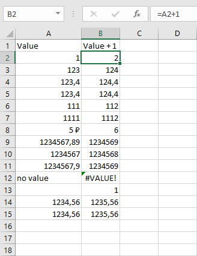
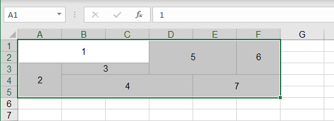
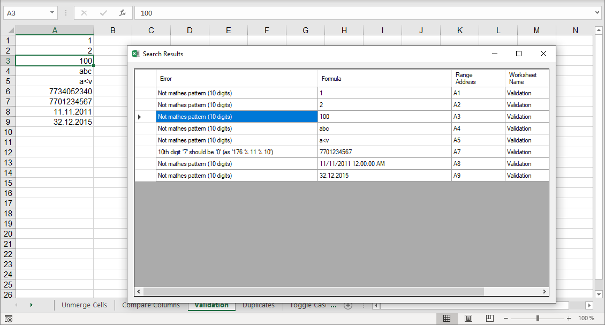

# Navferty's Excel Add-In

## Common tools for MS Excel ##

* Common Functions:
    * [Highlight Duplicates (different colors for groups of same values)](#highlight-duplications)
    * [Parse Numerics (convert numbers stored as text into numeric values)](#parse-numerics)
    * [Toggle Case (toggle lowercase-UPPERCASE-Camel Case)](#toggle-case)
    * [Trim Spaces (delete trailing spaces and extra line breaks in selection)](#trim-spaces)
    * [Unmerge Cells (unmerge cells and fill each cell with original value)](#unmerge-cells)
    * [Unprotect Workbook (remove protection for workbook and each worksheet)](#unprotect-workbook)
    * [Export table to markdown (table in markdown format will be placed to clipboard)](#export-table-to-markdown)
    * [Validate cell values (numerics, dates, XML text etc.)](#validate-cell-values)
    * [Find all cells containing errors on sheet](#find-all-cells-containing-errors)
    * Cut Names (make commonly used names shorter) *under development*

* [XML Functions:]()
    * [Create Sample XML based on XSD (you need to select XSD file)](#create-sample-xml-based-on-xsd)
    * [Validate XML with XSD (check selected xml based on XSD-schema)](#validate-xml-with-xsd)

* [How to install](#how-to-install)

## Highlight duplications ##
Fill different droups of duplicated values with different colors.

## Parse Numerics ##
Convert numbers stored as text to numeric format.

## Toggle Case ##
Toggle text case in selected cells (UPPERCASE->lowercase->Camel Case).

## Unmerge Cells ##

Unmerge cells and fill each cell of merge area with initial value.

## Trim Spaces ##
Trim spaces in text values, remove extra space symbols and new line symbols. Delete values in empty cells.

## Validate cell values ##
Check values in selected cells as numerics, valid dates, valid text for XML contents, russian TIN (known as 'ИНН') etc.

## Find all cells containing errors ##
Find all cells with errors like '#VALUE!', '#REF!' etc. on current worksheet.

## Unprotect Workbook ##
Remove protection without password from workbook and all worksheets, unlock VBA project if it exists.

## Export table to markdown ##
Contents of celected cells will be copied to clipboard in markdown format.

## Create Sample XML based on XSD ##
Select file with an XSD schema and create a sampe XML based on that shema.

## Validate XML with XSD ##
Check XML file with XSD schema. Select xml and xsd files, and report with all validation errors and warnings will be created in new workbook.

# How to install #

The solution is build in Azure, you can download installation files from there.
Visit https://navferty.visualstudio.com/NavfertyExcelAddIn/_build?definitionId=3
then select latest build and download installation files as build artifacts:

Extract files to a folder and run '.vsto' file. *Using desktop folder is recommended - for installing updates you will need to do it from the same folder that was used to install add-in for the first time!*

After installation process is completed, run (or restart) Excel application, and you will see new tab:

*Used icons are designed by iconarchive, Flaticon*
*"Find errors" icon made by turkkub from www.flaticon.com*
