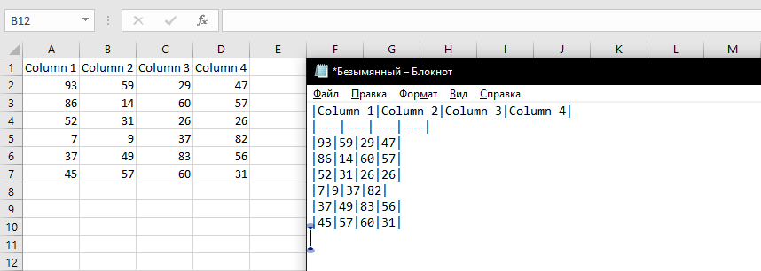

# Navferty's Excel Add-In
## Common tools for MS Excel ##

**The Add-In is currently under development.**

* Common Functions:
    * Highlight Duplicates (different colors for groups of same values)
    * Parse Numerics (convert numbers stored as text into numeric values)
    * Toggle Case (toggle lowercase-UPPERCASE-Camel Case)
    * Trim Spaces (delete trailing spaces and extra line breaks in selection)
    * Unmerge Cells (unmerge cells and fill each cell with original value)
    * Unprotect Workbook (remove protection for workbook and each worksheet)
    * Export table to markdown (table in markdown format will be placed to clipboard)
    * Validate cell values (numerics, dates, XML text etc.)
    * Find all cells containing errors on sheet
    * Cut Names (make commonly used names shorter)

* XML Functions:
    * Create Sample XML based on XSD (you need to select XSD file)
    * Validate XML with XSD (check selected xml based on XSD-schema)

## Highlight duplications ##
Fill different droups of duplicated values with different colors.

## Parse Numerics ##
Convert numbers stored as text to numeric format.

## Toggle Case ##
Toggle text case in selected cells (UPPERCASE->lowercase->Camel Case).

## Unmerge Cells ##

Unmerge cells and fill each cell of merge area with initial value.

## Trim Spaces ##
Trim spaces in text values, remove extra space symbols and new line symbols. Delete values in empty cells.

## Validate cell values ##
Check values in selected cells as numerics, valid dates, valid text for XML contents, russian TIN (known as 'ИНН') etc.

## Find all cells containing errors ##
Find all cells with errors like '#VALUE!' on current worksheet.

## Unprotect Workbook ##
Remove protection without password from workbook and all worksheets, unlock VBA project if it exists.

## Export table to markdown ##
Contents of celected cells will be copied to clipboard in markdown format.

## Create Sample XML based on XSD ##
Select file with an XSD schema and create a sampe XML based on that shema.

## Validate XML with XSD ##
Check XML file with XSD schema. Select xml and xsd files, and report with all validation errors and warnings will be created in new workbook.

*Used icons are designed by iconarchive, Flaticon*
*"Find errors" icon made by turkkub from www.flaticon.com*
