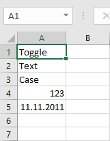
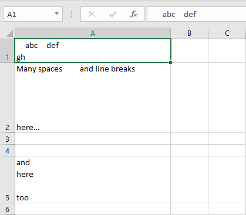
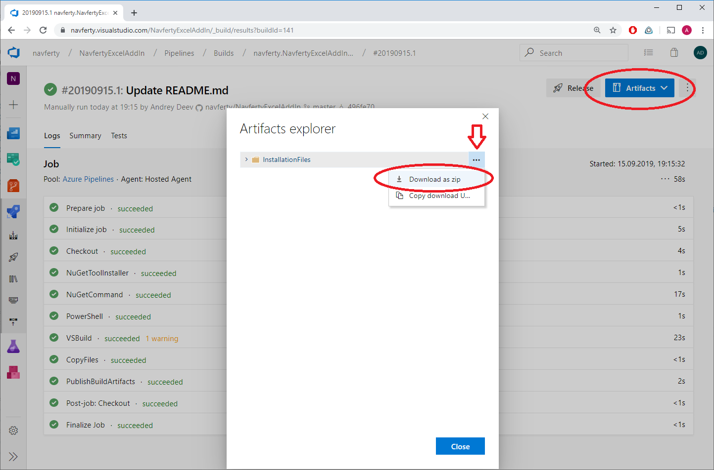
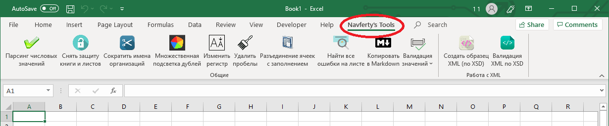

 [Russian](README_RU.md) |  **English**

# Navferty's Excel Add-In


## Available features
 - [Undo Last Action](#undo-last-action)
 - [Parse Numerics](#parse-numerics)
 - [Replace Chars (Transliteration or analogues)](#replace)
 - [Stringify Numerics to Words](#stringify-numerics-into-words)
 - [Toggle Case](#toggle-case)
 - [Trim Spaces](#trim-spaces)
 - [Remove File Protection](#remove-file-protection)
 - [Worksheets Protection](#worksheets-protection)
 - [Highlight Duplicates](#highlight-duplicates)
 - [Unmerge Cells](#unmerge-cells)
 - [Find Formula Errors in the selected range](#find-all-cells-containing-errors)
 - [Copy as Markdown](#copy-as-markdown)
 - [Validate Values](#validate-values)
 - [Export to SQLite](#export-to-sqlite)
 - [Create Sample XML based on XSD](#create-sample-xml-based-on-xsd)
 - [Validate XML with XSD](#validate-xml-with-xsd)

## [How to install](#how-to-install-the-add-in)

---

## Undo Last Action

|||
|:-:|---|
||Undo the last action performed with this add-in. Canceling is possible for some functions in the 'Converting values' and 'Formatting values' sections, and only if the range of cells was not edited after the action was performed.|

[Up](#navfertys-excel-add-in)

---

## Parse Numerics

|||
|:-:|---|
||Convert numbers stored as text to numeric format.|

<details>
  <summary>View screenshots</summary>


</details>

## Replace

|||
|:-:|---|
||Replace Russian characters in the match table.|

*   ### Transliteration

    |||
    |:-:|---|
    ||The entire Russian alphabet is completely changed to English. For example, the letter "Ж" will be replaced with "Zh", and the letter "Щ" with "Shch". Based on ICAO Doc [9303](https://www.icao.int/publications/Documents/9303_p3_cons_en.pdf).|

    <details>
      <summary>View screenshots</summary>

    
    
    </details>

* ### Replace Chars

    |||
    |:-:|---|
    ||Only matching letters of the alphabets will be replaced, such as: Аа, Вв, Ее, Кк, Мм, Нн, Оо, Рр, Сс, Тт, Уу, Хх.|

    <details>
      <summary>View screenshots</summary>

    
    
    </details>

## Stringify Numerics into Words

|||
|:-:|---|
||Converts numeric values to text representation<br>- In Russian<br>- In English<br>- In French|

<details>
  <summary>View screenshots</summary>


</details>

[Up](#navfertys-excel-add-in)

---

## Toggle Case

|||
|:-:|---|
||Case switching for text values in selected cells according to the scheme:<br>`Abcde` -> `abcde` -> `ABCDE`|

<details>
  <summary>View screenshots</summary>



</details>

## Trim Spaces

|||
|:-:|---|
||Clears the text content of the selected cells from unnecessary spaces. Removes repeated spaces and line breaks, as well as beginning and ending spaces in cells that have a text format.|

<details>
  <summary>View screenshots</summary>



</details>

[Up](#navfertys-excel-add-in)

---

## Remove File Protection

|||
|:-:|---|
||Allows you to unprotect all sheets of an open workbook as well as the entire workbook, without requiring a password, and also unlock the VBA project (if any) for which a password is set. This feature does not apply to encrypted workbooks.|

## Worksheets Protection

|||
|:-:|---|
||Allows you to set protection on multiple worksheets at once.|

## Highlight Duplicates

|||
|:-:|---|
||Sets the color of cells that contain duplicate values in the selected range. Different colors correspond to different groups of duplicates.|

<details>
  <summary>View a screenshot</summary>


</details>

## Unmerge Cells

|||
|:-:|---|
||Unmerge cells and fill each cell of merge area with initial value.|

<details>
  <summary>View screenshots</summary>


</details>

## Find all cells containing errors

|||
|:-:|---|
||Search for all cells in the selection that contain calculation errors:<br><br>Excel formula error types:<br>`#N/A`<br>`#NAME?`<br>`#DIV/0!`<br>`#REF!`<br>`#VALUE!`<br>`#NUM!`<br>`#NULL!`|

<details>
  <summary>View a screenshot</summary>


</details>

## Copy as Markdown

|||
|:-:|---|
||Contents of selected cells will be copied to clipboard in markdown format.|

<details>
  <summary>View a screenshot</summary>


</details>

## Validate values

|||
|:-:|---|
||<p>Check the cell values in the selected range for a specific format.<br><br>Supported formats: <br>- Number<br>- Date<br>- TIN of an individual\* (12 digits, with two verification digits)<br>- TIN of a legal entity\* (10 digits, with one verification digit)<br>- Text for XML (no `<` and `>` characters or other invalid characters for XML content)<br><br>\* _- The correct TIN does not guarantee the existence of an organization or individual who would own this INN_</p>

<details>
  <summary>View a screenshot</summary>


</details>

[Up](#navfertys-excel-add-in)

---

## Export to SQLite

|||
|:-:|---|
||Export the entire workbook to a SQLite database file. Each worksheet is converted to a separate table with automatic column type detection. Options include using the first row as column headers and skipping initial rows.|

<details>
  <summary>View screenshots</summary>


</details>

[Up](#navfertys-excel-add-in)

---

## Create Sample XML based on XSD

|||
|:-:|---|
||Select file with an XSD schema and create a sample XML based on that schema.|

For example, for the schema below
<details>
  <summary>XML schema sample - `sample.xsd`</summary>

```XML
<?xml version="1.0" encoding="UTF-8" ?>
<xs:schema xmlns:xs="http://www.w3.org/2001/XMLSchema">

<xs:element name="shiporder">
  <xs:complexType>
    <xs:sequence>
      <xs:element name="orderperson" type="xs:string"/>
      <xs:element name="shipto">
        <xs:complexType>
          <xs:sequence>
            <xs:element name="name" type="xs:string"/>
            <xs:element name="address" type="xs:string"/>
            <xs:element name="city" type="xs:string"/>
            <xs:element name="country" type="xs:string"/>
          </xs:sequence>
        </xs:complexType>
      </xs:element>
      <xs:element name="item" maxOccurs="unbounded">
        <xs:complexType>
          <xs:sequence>
            <xs:element name="title" type="xs:string"/>
            <xs:element name="note" type="xs:string" minOccurs="0"/>
            <xs:element name="quantity" type="xs:positiveInteger"/>
            <xs:element name="price" type="xs:decimal"/>
          </xs:sequence>
        </xs:complexType>
      </xs:element>
    </xs:sequence>
    <xs:attribute name="orderid" type="xs:string" use="required"/>
  </xs:complexType>
</xs:element>

</xs:schema>
```
</details>

The following xml-file will be generated:

<details>
  <summary>XML output - `sample.xml`</summary>

```XML
<shiporder xmlns:xsi="http://www.w3.org/2001/XMLSchema-instance" orderid="orderid1">
  <orderperson>orderperson1</orderperson>
  <shipto>
    <name>name1</name>
    <address>address1</address>
    <city>city1</city>
    <country>country1</country>
  </shipto>
  <item>
    <title>title1</title>
    <note>note1</note>
    <quantity>1</quantity>
    <price>1</price>
  </item>
  <item>
    <title>title2</title>
    <note>note2</note>
    <quantity>79228162514264337593543950335</quantity>
    <price>-79228162514264337593543950335</price>
  </item>
  <item>
    <title>title3</title>
    <note>note3</note>
    <quantity>2</quantity>
    <price>79228162514264337593543950335</price>
  </item>
  <item>
    <title>title4</title>
    <note>note4</note>
    <quantity>79228162514264337593543950334</quantity>
    <price>0.9</price>
  </item>
  <item>
    <title>title5</title>
    <note>note5</note>
    <quantity>3</quantity>
    <price>1.1</price>
  </item>
</shiporder>
```
</details>

## Validate XML with XSD

|||
|:-:|---|
||Check XML file with XSD schema. Select XML and XSD files, and a report with all validation errors and warnings will be created in a new workbook.|

Sample error report

|Severity|Element|Message|
|---|---|---|
|Error|city|The element 'shipto' has invalid child element 'city'. List of possible elements expected: 'address'.|
|Error|quantity|The 'quantity' element is invalid - The value '-5' is invalid according to its datatype 'http://www.w3.org/2001/XMLSchema:positiveInteger' - Value '-5' was either too large or too small for PositiveInteger.|
|Error|price|The 'price' element is invalid - The value 'asdasd' is invalid according to its datatype 'http://www.w3.org/2001/XMLSchema:decimal' - The string 'не число' is not a valid Decimal value.|

[Up](#navfertys-excel-add-in)

---

## How to Install the Add-In

### Online Install

You can install the add-in from the official website of the project:
[navferty.ru](https://www.navferty.ru). Just download and run setup.exe.

You may need to manually import the self-signed certificate before the installation process can be finished.

The installation process also requires an internet connection to load the latest version.

### Offline Install

The solution is built in Azure. You can download the full archive with installation files from there:

* Visit https://navferty.visualstudio.com/NavfertyExcelAddIn/_build?definitionId=3

* Select the latest build of 'NavfertyExcelAddIn - Publish' pipeline:


* Download published installation files:



* Extract files to a folder and run '.vsto' file:

> Using the desktop folder is highly recommended - installing updates
> is permitted only from the same folder where it was installed
> for the first time!


After the installation process is completed, run (or restart) the Excel application, and you will see a new tab:



[Up](#navfertys-excel-add-in)
