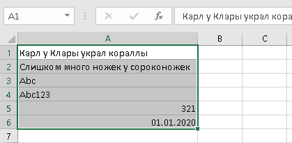
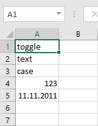

 **Русский** |  [English](readme.md)

# Надстройка Navferty Excel Add-In

Бесплатная надстройка для Excel, которая повышает продуктивность инструментами для обработки данных, форматирования и валидации.


## Функции
 - [Парсинг чисел](#парсинг-чисел)
 - [Заменить (Транслитерацией или на аналоги)](#заменить)
 - [Преобразовать числа в слова](#преобразовать-числа-в-слова)
 - [Изменить регистр](#изменить-регистр)
 - [Удалить пробелы](#удалить-пробелы)
 - [Снять защиту с книги](#снять-защиту-с-книги)
 - [Защита листов](#защита-листов)
 - [Подсветить дубликаты](#подсветить-дубликаты)
 - [Разъединить ячейки](#разъединить-ячейки)
 - [Найти все ошибки в выделенном диапазоне](#найти-все-ошибки-в-выделенном-диапазоне)
 - [Копировать в Markdown](#копировать-в-markdown)
 - [Валидация значений](#валидация-значений)
 - [Экспорт в SQLite](#экспорт-в-sqlite)
 - [Создать образец XML по XSD](#создать-образец-xml-по-xsd)
 - [Валидация XML по XSD](#валидация-xml-по-xsd)
 - [Отменить последнее действие](#отменить-последнее-действие)

## Установка

Скачайте и запустите [файл установки](https://deploy.navferty.ru/setup.exe) для установки надстройки в Excel.

После установки перезапустите Excel, если он был открыт. Вы увидите новую вкладку **Navferty's Tools** на ленте.

**Примечание:** Если возникает предупреждение о сертификате, см. [подробные инструкции по установке](#инструкция-по-установке) ниже.

---

## Парсинг чисел

|||
|:-:|---|
||Преобразование чисел, сохранённых как текст, в правильный числовой формат для использования в вычислениях.|

<details>
  <summary>Посмотреть скриншоты</summary>


</details>

## Заменить

|||
|:-:|---|
||Замена русских символов различными методами преобразования.|

### Транслитерацией

|||
|:-:|---|
||Полная транслитерация русского алфавита на английский. Например: "Ж" → "Zh", "Щ" → "Shch". Основано на документе ИКАО [9303](https://www.icao.int/publications/Documents/9303_p3_cons_ru.pdf).|

<details>
  <summary>Посмотреть скриншоты</summary>



</details>

### На аналоги

|||
|:-:|---|
||Замена только визуально схожих букв: А↔A, В↔B, Е↔E, К↔K, М↔M, Н↔H, О↔O, Р↔P, С↔C, Т↔T, У↔Y, Х↔X.|

<details>
  <summary>Посмотреть скриншоты</summary>


</details>

## Преобразовать числа в слова

|||
|:-:|---|
||Преобразование чисел в текстовое представление на разных языках:<br>• Русский<br>• Английский<br>• Французский|

<details>
  <summary>Посмотреть скриншоты</summary>


</details>

[Наверх](#надстройка-navferty-excel-add-in)

---

## Изменить регистр

|||
|:-:|---|
||Циклическое переключение регистра текста: `Абвгд` → `абвгд` → `АБВГД`|

<details>
  <summary>Посмотреть скриншоты</summary>





</details>

## Удалить пробелы

|||
|:-:|---|
||Удаление лишних пробелов, переносов строк и начальных/конечных пробелов из текстовых ячеек.|

<details>
  <summary>Посмотреть скриншоты</summary>


</details>

[Наверх](#надстройка-navferty-excel-add-in)

---

## Снять защиту с книги

|||
|:-:|---|
||Снятие защиты со всех листов, структуры книги и VBA-проектов без необходимости паролей. *Примечание: Не работает с зашифрованными книгами.*|

## Защита листов

|||
|:-:|---|
||Установка или снятие защиты с нескольких листов одновременно.|

## Подсветить дубликаты

|||
|:-:|---|
||Автоматическая цветовая кодировка повторяющихся значений в выбранном диапазоне. Разные цвета обозначают разные группы дубликатов.|

<details>
  <summary>Посмотреть скриншот</summary>


</details>

## Разъединить ячейки

|||
|:-:|---|
||Разъединение ячеек с заполнением каждой ячейки исходным объединённым значением.|

<details>
  <summary>Посмотреть скриншоты</summary>


</details>

## Найти все ошибки в выделенном диапазоне

|||
|:-:|---|
||Поиск всех ошибок формул в выбранном диапазоне: `#Н/Д`, `#ИМЯ?`, `#ДЕЛ/0!`, `#ССЫЛКА!`, `#ЗНАЧ!`, `#ЧИСЛО!`, `#ПУСТО!`<br><br>По клику на элемент в результатах поиска соответствующая ячейка будет выделена в рабочем листе.|

<details>
  <summary>Посмотреть скриншот</summary>


</details>

## Копировать в Markdown

|||
|:-:|---|
||Копирование выбранных ячеек в буфер обмена в формате markdown-таблицы.|

<details>
  <summary>Посмотреть скриншот</summary>


</details>

## Валидация значений

|||
|:-:|---|
||Проверка значений ячеек на соответствие определённым форматам: Число, Дата, ИНН физического лица (12 цифр), ИНН юридического лица (10 цифр), Текст для XML (без недопустимых символов).<br><br>*Примечание: Корректный формат ИНН не гарантирует существование организации или физического лица.*|

<details>
  <summary>Посмотреть скриншот</summary>


</details>

[Наверх](#надстройка-navferty-excel-add-in)

---

## Экспорт в SQLite

|||
|:-:|---|
||Экспорт всей книги в файл базы данных SQLite. Каждый лист становится отдельной таблицей с автоматическим определением типов столбцов.|

<details>
  <summary>Посмотреть скриншоты</summary>


</details>

[Наверх](#надстройка-navferty-excel-add-in)

---

## Создать образец XML по XSD

|||
|:-:|---|
||Генерация образца XML-файла из XSD-схемы для визуализации структуры.|

<details>
<summary>Посмотреть пример</summary>
<p><strong>Входная XSD-схема:</strong></p>

  <pre>&lt;?xml version="1.0" encoding="UTF-8" ?&gt;
&lt;xs:schema xmlns:xs="http://www.w3.org/2001/XMLSchema"&gt;
&lt;xs:element name="shiporder"&gt;
  <xs:complexType>
    <xs:sequence>
      <xs:element name="Заголовок" type="xs:string"/>
      <xs:element name="Адресат">
        <xs:complexType>
          <xs:sequence>
            <xs:element name="Имя" type="xs:string"/>
            <xs:element name="Адрес" type="xs:string"/>
            <xs:element name="Город" type="xs:string"/>
            <xs:element name="Страна" type="xs:string"/>
          </xs:sequence>
        </xs:complexType>
      </xs:element>
      <xs:element name="Элемент" maxOccurs="3">
        <xs:complexType>
          <xs:sequence>
            <xs:element name="Название" type="xs:string"/>
            <xs:element name="Описание" type="xs:string" minOccurs="0"/>
            <xs:element name="Количество" type="xs:positiveInteger"/>
            <xs:element name="Цена" type="xs:decimal"/>
          </xs:sequence>
        </xs:complexType>
      </xs:element>
    </xs:sequence>
    <xs:attribute name="Идентификатор" type="xs:string" use="required"/>
  </xs:complexType>
</xs:element>

</xs:schema>
```
</details>

Будет сформирован такой xml-файл:

<details>
  <summary>Результат генерации - sample.xml</summary>

```xml
<КорневойЭлемент xmlns:xsi="http://www.w3.org/2001/XMLSchema-instance" Идентификатор="Идентификатор1">
  <Заголовок>Заголовок1</Заголовок>
  <Адресат>
    <Имя>Имя1</Имя>
    <Адрес>Адрес1</Адрес>
    <Город>Город1</Город>
    <Страна>Страна1</Страна>
  </Адресат>
  <Элемент>
    <Название>Название1</Название>
    <Описание>Описание1</Описание>
    <Количество>1</Количество>
    <Цена>1</Цена>
  </Элемент>
  <Элемент>
    <Название>Название2</Название>
    <Описание>Описание2</Описание>
    <Количество>79228162514264337593543950335</Количество>
    <Цена>-79228162514264337593543950335</Цена>
  </Элемент>
  <Элемент>
    <Название>Название3</Название>
    <Описание>Описание3</Описание>
    <Количество>2</Количество>
    <Цена>79228162514264337593543950335</Цена>
  </Элемент>
</КорневойЭлемент>
```
</details>

## Валидация XML по XSD

|||
|:-:|---|
||Проверить соответствие xml-файла на основе XSD-схемы. Список ошибок будет выведен на лист в новой книге MS Excel.|

Пример отчёта о проверке:

|Уровень|Элемент|Ошибка|
|---|---|---|
|Error|Город|Элемент "Адресат" имеет недопустимый дочерний элемент "Город". Список ожидаемых элементов: "Адрес".|
|Error|Количество|Элемент "Количество" недействителен: значение "-5" недействительно с точки зрения его типа данных "http://www.w3.org/2001/XMLSchema:positiveInteger" — Значение "-5" недопустимо мало или недопустимо велико для PositiveInteger.|
|Error|Цена|Элемент "Цена" недействителен: значение "не число" недействительно с точки зрения его типа данных "http://www.w3.org/2001/XMLSchema:decimal" — Строка "не число" не является допустимым значением Decimal.|

[Наверх](#excel-надстройка-navfertys-tools)

---

## Отменить последнее действие

|||
|:-:|---|
||Отменить последнее действие, совершённое с помощью данной надстройки. Отмена возможна для некоторых функций в разделах 'Преобразование значений' и 'Форматирование значений' и только, если диапазон ячеек не редактировался после совершения действия.|

[Наверх](#excel-надстройка-navfertys-tools)

---

## Инструкция по установке

### Быстрая установка (рекомендуется)

1. Скачайте [setup.exe](https://deploy.navferty.ru/setup.exe)
2. Запустите установщик и следуйте инструкциям мастера
3. Перезапустите Excel, если он был открыт во время установки
4. Вы увидите новую вкладку **Navferty's Tools** на ленте

### Установка сертификата (если требуется)

Если возникает предупреждение о сертификате:

1. Щёлкните правой кнопкой мыши по файлу `setup.exe` и выберите **Свойства**
2. Перейдите на вкладку **Цифровые подписи**
3. Выберите подпись и нажмите **Сведения**
4. Нажмите **Просмотреть сертификат** → **Установить сертификат**
5. Выберите **Локальный компьютер** и поместите его в **Доверенные корневые центры сертификации**

*Примечание: Вы можете удалить сертификат после установки, но он потребуется для будущих обновлений.*

### Дополнительно: Офлайн-установка

Решение публикуется в Azure. Вы можете скачать полный архив с файлами установки:

1. Посетите https://navferty.visualstudio.com/NavfertyExcelAddIn/_build?definitionId=3
2. Выберите последнюю сборку 'NavfertyExcelAddIn - Publish'
3. Загрузите опубликованные файлы установки
4. Извлеките файлы в папку и запустите файл '.vsto'

> **Важно:** Рекомендуется использовать папку на рабочем столе - обновления разрешены только из той папки, где надстройка была установлена впервые.

После установки перезапустите Excel и вы увидите новую вкладку **Navferty's Tools**.

[Наверх](#надстройка-navferty-excel-add-in)
