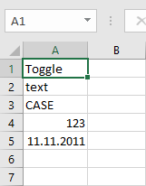
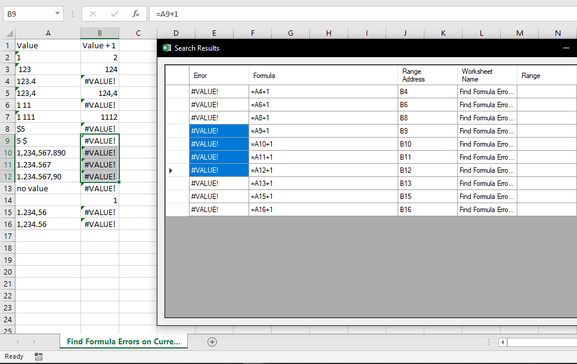

 **Russian** |  [English](readme.md)

# Excel-надстройка Navferty's Tools


## Реализованные функции

### Управление

- [Отменить последнее действие](#отменить-последнее-действие)

### Преобразование значений

- [В число](#В-число)
- [Замена (Транслитерация или на аналоги)](#Замена)
- [Число словами](#Число-словами)

### Форматирование значений

- [Регистр](#Регистр)
- [Очистить пробелы](#Очистить-пробелы)
- [Условное форматирование](#Условное-форматирование)

### Общие

- [Раскрасить дубли](#множественная-подсветка-дублей)
- [Разъединить](#разъединение-ячеек-с-заполнением)
- [Найти ошибки](#найти-все-ошибки-в-выделенном-диапазоне)
- [в Markdown](#копировать-в-markdown)
- [Проверка](#валидация-значений)

### Защита данных

- [Защита файла](#снять-защиту-с-книги-и-листов)
- [Защита листов](#защита-листов)

### Вид

- [Ярлычки листов](#снять-защиту-с-книги-и-листов)
- [Стиль ссылок (A1/R1C1)](#защита-листов)

### Работа с XML

- [Создать образец XML (по XSD)](#создать-образец-xml-по-xsd)
- [Валидация XML по XSD](#валидация-xml-по-xsd)

### Интернет-сервисы

- [Курсы валют](#создать-образец-xml-по-xsd)

---

## [Как установить](#инструкция-по-установке)

---

## В число

|||
|:-:|---|
||Преобразование чисел, сохраненных в виде текста, в числовой формат.|

<details>
  <summary>Посмотреть скриншоты</summary>


</details>

## Замена

|||
|:-:|---|
||Замена русских символов по таблицам соответствия.|

*   ### Транслитерация

    |||
    |:-:|---|
    ||Полностью меняется весь русский алфавит на английский. Например, буква "Ж" заменится на "Zh", а буква "Щ" - на "Shch". Основано на документе ИКАО [9303](https://www.icao.int/publications/Documents/9303_p3_cons_ru.pdf).|

    <details>
      <summary>Посмотреть скриншоты</summary>

    
    
    </details>

* ### На аналоги

    |||
    |:-:|---|
    ||Заменятся только схожие по верхнему регистру буквы алфавитов, такие как: Аа, Вв, Ее, Кк, Мм, Нн, Оо, Рр, Сс, Тт, Уу, Хх.|

    <details>
      <summary>Посмотреть скриншоты</summary>

    
    
    </details>

## Число словами

|||
|:-:|---|
||Переписывает числовые значения в текст с расшифровкой<br>- На русском<br>- На английском<br>- На французском|

<details>
  <summary>Посмотреть скриншоты</summary>


</details>

[Наверх](#excel-надстройка-navfertys-tools)

---

## Регистр

|||
|:-:|---|
||Переключение регистра для текстовых значений в выделенных ячейках по схеме:<br>`Абвгд` -> `абвгд` -> `АБВГД`|

<details>
  <summary>Посмотреть скриншоты</summary>




</details>

## Очистить пробелы

|||
|:-:|---|
||Очистить текстовое содержимое выделенных ячеек от лишних пробелов. Удаляет повторные пробелы и переносы строк, а также начальные и конечных пробелы в ячейках, имеющих текстовый формат.|

<details>
  <summary>Посмотреть скриншоты</summary>


</details>

[Наверх](#excel-надстройка-navfertys-tools)

---

## Условное форматирование

|||
|:-:|---|
||Починить правила условного форматирования в таблице. Если в таблице с уловным форматированием удалить или добавить строки, правила условного форматирования дублируются и дробятся на поддиапазоны, но у первой строки они обычно остаются неповреждёнными. Поэтому удаляем правила условного форматирования у всех строк, кроме первой и копируем правила с неё.|

[Наверх](#excel-надстройка-navfertys-tools)


---

## Снять защиту с книги и листов

|||
|:-:|---|
||Позволяет снять защиту со всех листов открытой книги, как и защиту всей книги, в отсутствие пароля, а также разблокировать VBA проект (при его наличии), на который установлен пароль. Функция не распространяется на зашифрованные книги.|

## Защита листов

|||
|:-:|---|
||Позволяет установить или снять защиту со множества листов книги одной командой.|

## Множественная подсветка дублей

|||
|:-:|---|
||Устанавливает цвет ячеек, которые содержат повторяющиеся значения, в выделенном диапазоне. Различные цвета соответствуют разным группам дублей.|

<details>
  <summary>Посмотреть скриншот</summary>


</details>

## Разъединение ячеек с заполнением

|||
|:-:|---|
||Отменяет объединение ячеек, с одновременным заполнением разъединенных ячеек исходым значением.|

<details>
  <summary>Посмотреть скриншоты</summary>


</details>

## Найти все ошибки в выделенном диапазоне

|||
|:-:|---|
||Поиск всех ячеек в выделенных ячейках, которые содержат ошибки вычислений:<br><br>Виды ошибок в MS Excel:<br>`#Н/Д`<br>`#ИМЯ?`<br>`#ДЕЛ/0!`<br>`#ССЫЛКА!`<br>`#ЗНАЧ!`<br>`#ЧИСЛО!`<br>`#ПУСТО!`|

<details>
  <summary>Посмотреть скриншот</summary>


</details>

## Копировать в Markdown

|||
|:-:|---|
||Копировать в буфер обмена выделенный фрагмент как таблица Markdown.|

<details>
  <summary>Посмотреть скриншот</summary>


</details>

## Валидация значений

|||
|:-:|---|
||<p>Проверить значения ячеек в выделенном диапазоне на соответствие определённому формату.<br><br>Поддерживаемые форматы:<br>- Число<br>- Дата<br>- ИНН ФЛ\* (12 цифр, с двумя проверочными цифрами)<br>- ИНН ЮЛ\* (10 цифр, с одной проверочной цифрой)<br>- Текст для XML (отсутствие символов `<` и `>` и иных невалидных для содержимого XML)<br><br>\* _- Корректность ИНН не гарантирует существование организации или физического лица, которому бы принадлежал этот ИНН_</p>|

<details>
  <summary>Посмотреть скриншот</summary>


</details>

[Наверх](#excel-надстройка-navfertys-tools)

---

## Создать образец XML (по XSD)

|||
|:-:|---|
||Сгенерировать пример XML-файла по xsd-схеме. Позволяет получить наглядное представление о структуре xml-файла при наличии XSD-файла со схемой.|

Например, для приведённой ниже схемы
<details>
  <summary>Образец схемы - sample.xsd</summary>

```xml
<?xml version="1.0" encoding="UTF-8" ?>
<xs:schema xmlns:xs="http://www.w3.org/2001/XMLSchema">

<xs:element name="КорневойЭлемент">
  <xs:complexType>
    <xs:sequence>
      <xs:element name="Заголовок" type="xs:string"/>
      <xs:element name="Адресат">
        <xs:complexType>
          <xs:sequence>
            <xs:element name="Имя" type="xs:string"/>
            <xs:element name="Адрес" type="xs:string"/>
            <xs:element name="Город" type="xs:string"/>
            <xs:element name="Страна" type="xs:string"/>
          </xs:sequence>
        </xs:complexType>
      </xs:element>
      <xs:element name="Элемент" maxOccurs="3">
        <xs:complexType>
          <xs:sequence>
            <xs:element name="Название" type="xs:string"/>
            <xs:element name="Описание" type="xs:string" minOccurs="0"/>
            <xs:element name="Количество" type="xs:positiveInteger"/>
            <xs:element name="Цена" type="xs:decimal"/>
          </xs:sequence>
        </xs:complexType>
      </xs:element>
    </xs:sequence>
    <xs:attribute name="Идентификатор" type="xs:string" use="required"/>
  </xs:complexType>
</xs:element>

</xs:schema>
```
</details>

Будет сформирован такой xml-файл:

<details>
  <summary>Результат генерации - sample.xml</summary>

```xml
<КорневойЭлемент xmlns:xsi="http://www.w3.org/2001/XMLSchema-instance" Идентификатор="Идентификатор1">
  <Заголовок>Заголовок1</Заголовок>
  <Адресат>
    <Имя>Имя1</Имя>
    <Адрес>Адрес1</Адрес>
    <Город>Город1</Город>
    <Страна>Страна1</Страна>
  </Адресат>
  <Элемент>
    <Название>Название1</Название>
    <Описание>Описание1</Описание>
    <Количество>1</Количество>
    <Цена>1</Цена>
  </Элемент>
  <Элемент>
    <Название>Название2</Название>
    <Описание>Описание2</Описание>
    <Количество>79228162514264337593543950335</Количество>
    <Цена>-79228162514264337593543950335</Цена>
  </Элемент>
  <Элемент>
    <Название>Название3</Название>
    <Описание>Описание3</Описание>
    <Количество>2</Количество>
    <Цена>79228162514264337593543950335</Цена>
  </Элемент>
</КорневойЭлемент>
```
</details>

## Валидация XML по XSD

|||
|:-:|---|
||Проверить соответствие xml-файла на основе XSD-схемы. Список ошибок будет выведен на лист в новой книге MS Excel.|

Пример отчёта о проверке:

|Уровень|Элемент|Ошибка|
|---|---|---|
|Error|Город|Элемент "Адресат" имеет недопустимый дочерний элемент "Город". Список ожидаемых элементов: "Адрес".|
|Error|Количество|Элемент "Количество" недействителен: значение "-5" недействительно с точки зрения его типа данных "http://www.w3.org/2001/XMLSchema:positiveInteger" — Значение "-5" недопустимо мало или недопустимо велико для PositiveInteger.|
|Error|Цена|Элемент "Цена" недействителен: значение "не число" недействительно с точки зрения его типа данных "http://www.w3.org/2001/XMLSchema:decimal" — Строка "не число" не является допустимым значением Decimal.|

[Наверх](#excel-надстройка-navfertys-tools)

---

## Отменить последнее действие

|||
|:-:|---|
||Отменить последнее действие, совершённое с помощью данной надстройки. Отмена возможна для некоторых функций в разделах 'Преобразование значений' и 'Форматирование значений' и только, если диапазон ячеек не редактировался после совершения действия.|

[Наверх](#excel-надстройка-navfertys-tools)

---

## Инструкция по установке

### Онлайн-установка

Вы можете установить надстройку с официального сайта проекта:
[navferty.ru](https://www.navferty.ru). Скачайте и запустите файл setup.exe.

Для завершения установки может потребоваться вручную импортировать сертификат, которым подписана надстройка.

Также этот способ требует подключения к интернету для завершения установки.

### Офлайн-установка

Решение публикуется автоматически в Azure, Вы можете скачать полный архив с установочными файлами оттуда:

* Посетите https://navferty.visualstudio.com/NavfertyExcelAddIn/_build?definitionId=3

* Выберите последнюю версию сборки 'NavfertyExcelAddIn - Publish':

  

* Загрузите опубликованные установочные файлы:

  

* Извлеките файлы в папку и запустите файл '.vsto':

  > Настоятельно рекомендуется использовать папку рабочего стола - установка обновлений разрешена только из той папки, из которой надстройка была установлена в первый раз!

  

* После завершения процесса установки запустите (или перезагрузите) приложение Excel, и вы увидите новую вкладку:

  

[Наверх](#excel-надстройка-navfertys-tools)
