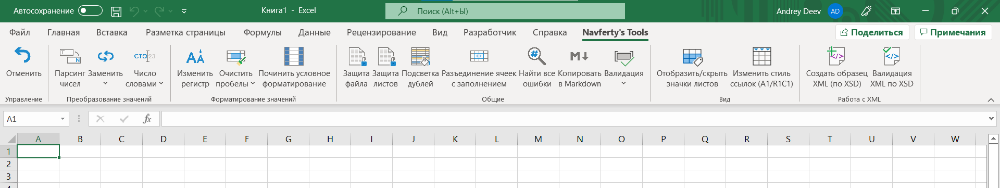

##### The documentation is written in Russian. Available in English at the [link](READMI_RU.md).

# Excel-надстройка Navferty's Tools

## Навигация
  - [Управление](#управление)
    - [Отменить последнее действие](#отменить-последнее-действие)
  - [Преобразование значений](#преобразование-значений)
    - [Парсинг числовых значений](#парсинг-числовых-значений)
    - [Заменить](#заменить)
      - [Транслитерацией](#транслитерацией)
      - [На аналоги](#на-аналоги)
    - [Преобразовать в слова](#преобразовать-в-слова)
      - [На русском](#на-русском)
      - [На английском](#на-английском)
      - [На французском](#на-французском)
    - [Форматирование значений](#форматирование-значений)
      - [Изменить регистр](#изменить-регистр)
      - [Удалить пробелы](#удалить-пробелы)
  - [Общие](#общие)
    - [Снять защиту с книги и листов](#снять-защиту-с-книги-и-листов)
    - [Множественная подсветка дублей](#множественная-подсветка-дублей)
    - [Разъединение ячеек с заполнением](#разъединение-ячеек-с-заполнением)
    - [Найти все ошибки на листе](#найти-все-ошибки-на-листе)
    - [Копировать в Markdown](#копировать-в-markdown)
    - [Валидация значений](#валидация-значений)
      - [Число](#число)
      - [Текст для XML](#текст-для-xml)
      - [Дата](#дата)
      - [ИНН ФЛ](#инн-фл)
      - [ИНН ЮЛ](#инн-юл)
  - [Работа с XML](#работа-с-xml)
    - [Создать образец XML (по XSD)](#создать-образец-xml-по-xsd)
    - [Валидация XML по XSD](#валидация-xml-по-xsd)

  - [В разработке](#в-разработке)
    - [Сократить название организаций](#сократить-название-организаций)

  - [Инструкция по установке](#инструкция-по-установке)

---

## Управление

### Отменить последнее действие

[Наверх](#navfertys-excel-add-in)

---

## Преобразование значений

### Парсинг числовых значений

|||
|:-:|---|
||Convert numbers stored as text to numeric format.|

### Заменить (иконка будет заменена)

|||
|:-:|---|
||Замена русских символов по таблицам соответствия.|

*   #### Транслитерацией

    |||
    |:-:|---|
    ||Полностью меняется весь русский алфавит на английский. Например, буква "Ж" заменится на "Zh", а буква "Щ" - на "Shch".|

* #### На аналоги (иконта будет изменена)

    |||
    |:-:|---|
    ||Заменятся только схожие по верхнему регистру буквы алфавитов, такие как: Аа, Вв, Ее, Кк, Мм, Нн, Оо, Рр, Сс, Тт, Уу, Хх.|

### Преобразовать в слова

#### На русском

#### На английском

#### На французском

### Форматирование значений

#### Изменить регистр

#### Удалить пробелы
Trim spaces in text values, remove extra space symbols and new line symbols. Delete values in empty cells.

[Наверх](#navfertys-excel-add-in)

---

## Общие

### Снять защиту с книги и листов
Remove protection without password from workbook and all worksheets, unlock VBA project if it exists.

### Множественная подсветка дублей
Fill different droups of duplicated values with different colors.

### Разъединение ячеек с заполнением
Unmerge cells and fill each cell of merge area with initial value.

### Найти все ошибки на листе
Find all cells with errors like '#VALUE!', '#REF!' etc. on current worksheet.

### Копировать в Markdown
Contents of celected cells will be copied to clipboard in markdown format.

### Валидация значений
Check values in selected cells as numerics, valid dates, valid text for XML contents, russian TIN (known as 'ИНН') etc.

#### Число

#### Текст для XML

#### Дата

#### ИНН ФЛ

#### ИНН ЮЛ

[Наверх](#navfertys-excel-add-in)

---

## Работа с XML

### Создать образец XML (по XSD)

### Валидация XML по XSD

[Наверх](#navfertys-excel-add-in)

---

## В разработке

### Сократить название организаций

[Наверх](#navfertys-excel-add-in)

---

## Инструкция по установке

[Наверх](#navfertys-excel-add-in)